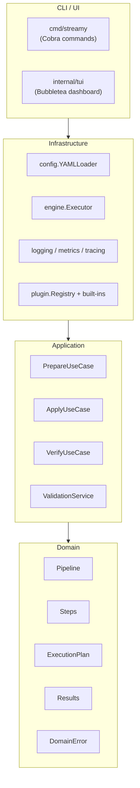
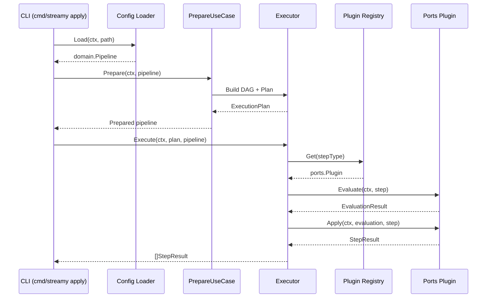

# Architecture Overview

Streamy follows a four-layer domain-driven architecture, with the CLI sitting above the core infrastructure, application, and domain layers. Each layer has a
clear responsibility and directional dependency rules. Mermaid sources for the
diagrams below live under `docs/diagrams/`.

```text
┌─────────────────────────────────────────────┐
│                   CLI (cmd)                 │
│  - Cobra commands wire the composition root │
│  - Provides UX (flags, prompts, dashboards) │
└──────────────────────┬──────────────────────┘
                       │
┌──────────────────────▼──────────────────────┐
│            Infrastructure Layer             │
│  internal/infrastructure/...                │
│  - Config adapters (YAML loader)            │
│  - Engine (DAG builder, executor)           │
│  - Observability (logging, metrics, tracing)│
│  - Plugin registry + built-in plugins       │
│  - Implements ports exposed by application  │
└──────────────────────┬──────────────────────┘
                       │
┌──────────────────────▼──────────────────────┐
│             Application Layer               │
│  internal/application/...                   │
│  - Use cases (prepare, apply, verify)       │
│  - Validation service                       │
│  - Coordinates domain + ports interfaces    │
└──────────────────────┬──────────────────────┘
                       │
┌──────────────────────▼──────────────────────┐
│                Domain Layer                 │
│  internal/domain/...                        │
│  - Pipeline aggregate + invariants          │
│  - Step + Settings value objects             │
│  - Execution plan + results                 │
│  - Validation descriptions                  │
│  - Domain errors                            │
└─────────────────────────────────────────────┘
```

## Layer Responsibilities



### Domain (`internal/domain`)
- Pure Go value objects with zero infrastructure dependencies.
- Encodes business rules: step validation, dependency cycles, result semantics.
- Provides typed error codes (`ErrCodeValidation`, `ErrCodeExecution`, etc.) for consistent handling.

### Application (`internal/application`)
- Uses domain types plus port interfaces from `internal/ports`.
- Implements use cases (`PrepareUseCase`, `ApplyUseCase`, `VerifyUseCase`) that orchestrate the workflow.
- Enforces context propagation, structured logging, and event publication.
- Validation service bridges legacy filesystem checks while returning domain-friendly summaries.

### Infrastructure (`internal/infrastructure`)
- Implements the ports exposed by the application layer:
  - `config`: YAML loader converts files into domain pipelines.
  - `registry`: file-backed pipeline store that reconciles dependency status on each add and keeps the status cache in sync.
  - `engine`: DAG builder, planner, executor built on goroutines.
  - `logging`, `metrics`, `tracing`: adapters over charmbracelet/log, custom collectors, and tracer spans.
  - `plugin`: in-memory registry for ports-native plugins.
  - `events`: event publisher for lifecycle hooks.
- Houses the ports-native built-in plugins under `internal/plugins`.

### CLI (`cmd/streamy`)
- Acts as the composition root: constructs infrastructure adapters, builds application use cases, and wires Cobra commands.
- Seeds correlation IDs, configures logging verbosity, and exposes top-level commands (`apply`, `verify`, `dashboard`, etc.).
- `streamy run --registry` enforces confirmation before honoring `--force`, and requires `--yes` when running in non-interactive mode to preserve safety-by-default.
- Registers built-in plugins through `RegisterPortsPlugins`, ensuring deterministically validated metadata before execution.

## Dependency Rules
- Domain depends only on the standard library.
- Application imports domain and ports.
- Infrastructure imports ports (to implement interfaces) and domain value objects for data exchange.
- CLI may reference all layers but must not expose infrastructure types outside the composition root.

Static enforcement:
- `golangci-lint` is configured with import guards to block reverse dependencies.
- Ports live in `internal/ports`, clarifying the API boundary.

## Data Flow
1. **Configuration**: `cmd/streamy` instantiates `config.YAMLLoader`. `Load(ctx, path)` returns a fully validated domain pipeline, then `registry.ReconcileStatuses` updates downstream readiness and syncs the status cache whenever `streamy registry add` persists a new entry.
2. **Preparation**: `PrepareUseCase` builds the execution plan using infrastructure DAG builder and planner ports.
3. **Execution**: `ApplyUseCase` or `VerifyUseCase` invokes the engine executor. Plugins are resolved through the registry port and executed with the current context, metrics, tracing, and events.
4. **Observability**: Each layer logs with charmbracelet/log, metrics collectors capture counts/durations, and the tracer emits spans with correlation IDs.
5. **Results**: Domain `StepResult`/`VerificationResult` objects flow back to the CLI, which renders text tables, verbose output, or JSON.



## Plugin Lifecycle
- Plugins satisfy the `ports.Plugin` interface:
  - `Metadata()` returns `domain/plugin.Metadata` describing identity, version, and dependencies.
  - `Evaluate()` inspects state without side effects.
  - `Apply()` performs mutations using optional internal data from `Evaluate`.
- Built-in plugins live in `internal/plugins/<name>` and rely solely on domain + standard library.
- Contract tests (`internal/plugins/contracts_test.go`) assert metadata validity and cancellation semantics across all built-ins.

## Testing Strategy
- Domain and application layers use table-driven unit tests stored alongside the code.
- Infrastructure adapters include focused unit tests and integration suites (e.g., executor integration, YAML loader).
- CLI has command-level tests validating wiring and error formatting.
- End-to-end coverage resides in `tests/` harnesses, operating entirely through application ports to mimic production usage.
- `golangci-lint` plus `go test ./...` run in CI to gate regressions. Previous legacy packages are removed, so dependency cycles are eliminated.

## Context & Correlation
- Every public port method accepts `context.Context`.
- CLI seeds correlation IDs stored within log contexts; infrastructure propagates them to events, metrics, and spans.
- Cancellation is respected at the domain boundary (validation service) and within infrastructure components (I/O, executor loops, plugins).
